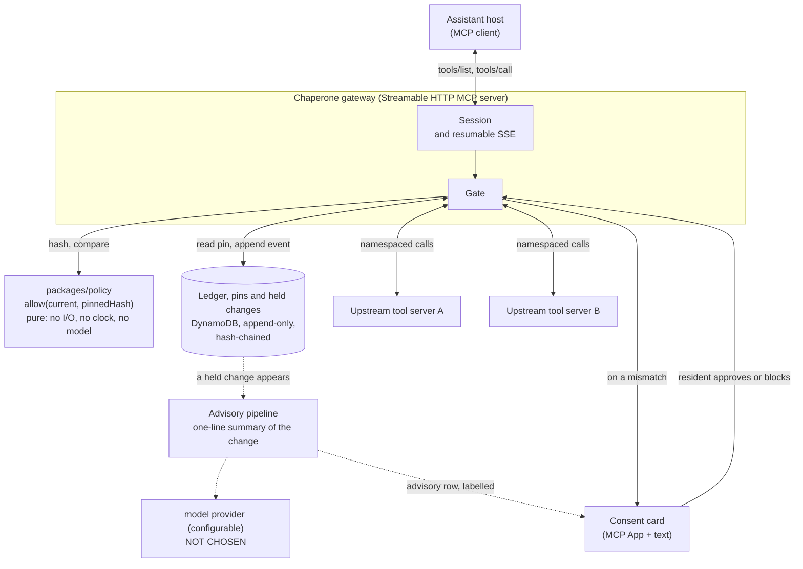

An assistant re-reads the instructions for every tool it owns, every time it
connects, and remembers nothing about what they said last time. Chaperone is
that memory. It sits alongside the assistant's connections to third-party
tool servers, keeps a record of what each tool claimed the last time a
resident approved it, and tells the household, in one sentence, the moment
that claim changes.

It is built for Alexa+ households: a context-aware add-on that maintains state
across sessions, so when a tool the assistant uses changes its own wording, the
resident sees the old and the new sentence side by side before anything runs.
The demo is a *simulated* Alexa+ experience, a web page in which a rule-based
stand-in plays the assistant (see the quickstart below); it is not made by or
affiliated with Amazon.

# Chaperone

## What it does

When a resident approves a tool for the household's assistant, Chaperone
remembers exactly what that tool said it would do. The next time the tool's
words have changed, the assistant is not allowed to use it, and the resident
sees a short card with the sentence they approved beside the sentence that
replaced it. They choose to approve the change or keep it blocked, and until
they do, every other tool carries on working.

## Quickstart (no AWS account)

You need Git, Node 24 (see `.nvmrc`), pnpm 12.4.1 (`corepack enable` picks it
up from `package.json`), and Docker Desktop running. On Windows, clone into a
short path such as `C:\src\chaperone`: a deeply nested folder trips the
260-character path limit and `git clone` stops with "Filename too long".

**1. Set up** (the `docker compose` step builds two images, and is most of the
time the first time; see the measured times below):

```
git clone https://github.com/nirmalraj142007-byte/Chaperone.git
cd Chaperone
pnpm install
pnpm build
docker compose up -d --build
pnpm demo:reset
```

`pnpm demo:reset` builds the demo state (and, the first time, the console
bundle) and prints the beats. Skipping `pnpm build` fails with
`ERR_MODULE_NOT_FOUND`, because the scripts load the workspace packages from
their built output. If `docker compose up` reports that a container name is
already in use, another checkout's stack exists: run `docker compose down` in
that checkout first (the container names are fixed).

**2. Run the demo.** The primary surface is the *simulated Alexa+ experience*: a
web page with a conversation, where you talk to a household assistant and the
review card appears inside the conversation. In a second terminal:

```
pnpm demo:assistant
```

then open <http://localhost:5174> and:

1. Type (or tap) **add batteries to my list**. It works: `Added 1 × batteries to
   the shopping list.`
2. In the first terminal, run `pnpm demo:mutate`. That makes the tool's server
   change `add_item`'s description, which is the thing that happens in the real
   world without anyone telling you.
3. Type **add batteries to my list** again. The tool does not run. You get the
   refusal, in words that never change, and under it the card, inside the
   conversation: the added sentence highlighted, "can change your data", "You
   approved this on 12 January".
4. Press **Approve** (or **Keep blocked**) on the card. Ask again: after an
   approval it runs; after Keep blocked it stays blocked.

A collapsible "What just happened" panel shows the tool called, the MCP session
ID, the protocol version and the latency of each call. **There is no model on
that page.** The assistant is a rule-based stand-in for the assistant's model
(fixed phrases mapped to tool calls, all in
[`packages/assistant-sim/src/rules.ts`](packages/assistant-sim/src/rules.ts)),
and the page says so on screen. What it is real about: it talks to the gateway
over MCP Streamable HTTP with the official SDK client, and it hosts the card as
an MCP App (the `ui/initialize` handshake of `@modelcontextprotocol/ext-apps`,
in a sandboxed frame), so Approve and Keep blocked are real calls to
`chaperone/approve_change`. Speech (`speechSynthesis`) is available behind a
toggle, off by default; typed input is the primary way to talk to it.

**Or, without a browser** (the command-line path; the timings below were
measured on it). Each command is copy-pasteable; run them in order:

```
pnpm demo:call
pnpm demo:call grocery__add_item item=batteries
pnpm demo:mutate
pnpm demo:call grocery__add_item item=batteries
```

1. `pnpm demo:call` lists the tools the assistant can see.
2. The first `add_item` works: `Added 1 × batteries to the shopping list.`
3. `pnpm demo:mutate` makes the tool's server change `add_item`'s description,
   which is the thing that happens in the real world without anyone telling
   you.
4. The second `add_item` is refused, in words that never change, followed by
   the card: the added sentence marked `{+ +}`, "can change your data", "You
   approved this on 12 January", and two lines that begin `[Approve]` and
   `[Keep blocked]`.

Copy the `[Approve]` line from the card, put `pnpm demo:call` in front of it,
and run it. Then:

```
pnpm demo:call grocery__add_item item=batteries
pnpm demo:ledger
```

The tool works again, and `pnpm demo:ledger` walks the household's hash chain
and prints `chain OK — 9 events verified`.

Optional, in a second terminal, to see the supporting operator console (the held change, the ledger, the evidence so far):

```
pnpm --filter @chaperone/console exec vite preview
```

then open <http://localhost:4173/queue> (the held change and its card),
`/ledger` (the chain), and `/corpus` (the evidence so far). `pnpm demo:reset`
puts everything back for another run.

To check all of it headlessly: `pnpm demo:verify` walks the same beats in a real
browser and asserts each one (11 pass, 1 skipped by design: the drift chart
has nothing to draw until crawl 2). It needs Chromium once:
`pnpm exec playwright install chromium`.

**Two things in the demo are hand-written stand-ins, and both are labelled on
screen.** The one-line "advisory" on the card is a fixture, not model output,
and the household's "12 January" approval history is staged. Everything else,
the check, the refusal text, the hashes and the ledger, is the real code.
[`demo/OFFLINE.md`](demo/OFFLINE.md) lists exactly which is which.

**Measured**, from a fresh clone of commit `bafc5f5` on the author's Windows 11
laptop (16 threads, Docker Desktop, about 2 GB of free RAM), running every
command above in order, then the seven demo commands (a script pulled the
`[Approve]` line out of the card instead of a person copying it); the times are
seconds from the start of `git clone` to `chain OK`:

| Run | Clone | install | build | compose up | demo:reset | demo commands | **Total** |
|---|---:|---:|---:|---:|---:|---:|---:|
| First run: Docker had to build both images | 4 | 36 | 12 | 328 | 91 | 50 | **521** (8 min 41 s) |
| Second run: images and the pnpm store already cached | 6 | 18 | 7 | 15 | 16 | 19 | **81** |

So "about 90 seconds" is the warm figure. **The first time, expect several
minutes** (8 min 41 s above), almost all of it Docker building two images, plus
the demo building the console bundle. For scale, a separate
`docker compose build --no-cache` of the same Dockerfiles took 106 s when run
on its own; why the build inside the first row took 328 s was not established,
and this laptop has little memory to spare. A machine with a warm Docker cache,
which is the state "ready to film" means, is the 81 s row.

**One-time online prerequisites**, from [`demo/OFFLINE.md`](demo/OFFLINE.md).
After these, the demo needs no network at all:

```
pnpm install
pnpm build
docker compose build                       # builds the gateway and demo-upstream images
docker compose pull ddb                    # DynamoDB Local
docker pull alpine/socat                   # only for the no-egress overlay
pnpm exec playwright install chromium      # only for demo:verify
```

## What this does not prove

This is the audit of the claims this project could have made and does not.

- **"Quarantine caught 100% of changed tools" is cut from every claim.** It is
  a hash comparison run against an attack corpus the author wrote, so it
  cannot come out any other way. It is **tautological**: a correctness
  property, not a result. A block rate is reported only as a delta against
  baseline 2 (an unaided model), never as an absolute, and `packages/eval` has
  a test that fails if an absolute leaks into a report.
- **The drift rate is not measured yet.** Crawl 2 runs on 2026-10-20, 35 days
  after crawl 1. The prediction (20 to 40%) was committed before crawl 1 and
  will be reported against whatever comes out, including if it is low.
- **Baseline 2 is not measured.** No model provider is chosen, and Bedrock
  access for this AWS account was declined. Nothing in this repo states a
  provider as chosen.
- **The sample is the servers that boot without credentials**, 152 of 947
  candidates. That likely understates drift.
- **Classifying a change is one person's reading.** Detecting that a change
  happened is not: it is a hash comparison. Deciding whether it was cosmetic,
  additive or a change of meaning is the author reading it.
- **The 30 ms latency budget is unverified.** It has been measured only
  against DynamoDB Local, where it fails.
- **It detects changed claims, not malicious behaviour.**

The reasoning behind each is in [`docs/LIMITATIONS.md`](docs/LIMITATIONS.md),
and the questions a reviewer is likely to ask are answered in
[`docs/QA.md`](docs/QA.md).

## The numbers

Each number has its provenance and the command or file that reproduces it.
Anything not yet measured is a `{{PENDING}}` marker. No value has been
estimated to fill one.

### Crawl 1 (2026-09-15)

Started 2026-09-15T06:19:42.282Z, finished 06:51:29.907Z
(`data/crawl-1-report.json`). The candidate list is frozen
(`corpus/candidates.json`) and crawl 2 runs against it unchanged.

| | Value | Source | Reproduce |
|---|---:|---|---|
| Candidate servers | 947 | `data/crawl-1-report.json` | `corpus/candidates-README.md` explains where they came from |
| No discoverable install command | 656 | `data/boot-rate.json` | `pnpm crawl:boot-rate --crawl-id=crawl-1` |
| Attempted | 291 | `data/boot-rate.json` | same |
| **Captured** (booted, tool list read) | **152** | `data/boot-rate.json` | same |
| **Did not start from their own setup instructions** | **47.8%** (139 of 291) | `data/boot-rate.json` | same |
| Tools captured | 6,058 | `data/crawl-1-report.json` | same |

`pnpm crawl:boot-rate` re-derives the boot figures from the committed report
and rewrites `data/boot-rate.json` (verified 2026-09-24: identical output; the copy
under `benchmarks/` is written by `pnpm bench`). It does not re-run the crawl. The crawl itself
(`pnpm crawl:run`) is not something to run casually; see `CLAUDE.md`.

**Capability distribution under classifier v2**
(`data/crawl-1-capabilities-v2.json`, reproduced by `pnpm crawl:reclassify-v2`):

| Class | Tools | Share |
|---|---:|---:|
| read | 4,185 | 69.1% |
| write | 1,300 | 21.5% |
| communicate | 371 | 6.1% |
| transact | 202 | 3.3% |

This is the corrected distribution. The first classifier (v1) had no verb
matching "add" and missed 196 tools that write (write was 18.2%, now 21.5%).
`read` is the residual class: every one of its 4,185 verdicts is low
confidence. The correction and what it does and does not establish are in
[`docs/LIMITATIONS.md`](docs/LIMITATIONS.md).

### Baseline 1: a regex blocklist

Against the 30-item author-written attack corpus (`corpus/attacks/`) and 40
benign definitions: **15 of 30 detected (50.0%), 0 of 40 false positives.**
By pattern: direct-instruction 0/6, false-authority 6/6, data-exfiltration 3/6,
scope-widening 2/6, delayed-trigger 4/6. Source: `data/baselines.json`;
reproduce with `pnpm eval:report`. It is a comparison point, not a headline.

### Cost per call: four DynamoDB writes

Every gated `tools/call` performs one pin read plus two resumable-SSE event
store events, each an `UpdateItem` and a `PutItem`: **four DynamoDB write
operations per call.** That is a property of Chaperone and transfers between
environments (`benchmarks/latency.json`, `environment.storageWritesPerToolCall`).
The milliseconds do not transfer, because they belong to the storage backend.

Measured at concurrency 4, 1000 samples per mode, against **DynamoDB Local**
(a single-writer SQLite process that saturates at roughly 60 writes per
second), on one machine, at commit `e7a453b` on a dirty tree:

| Backend | Added p50 | Added p95 | Added p99 |
|---|---:|---:|---:|
| `dynamodb-local` | 480.53 ms | 591.89 ms | 635.63 ms |

That is Chaperone's added latency against a single-writer local backend, not
its added latency. The 30 ms p95 budget is enforced by exit code: `pnpm bench`
exits 1 over budget, and **it currently exits 1.** The bench file records the
backend as a required field so a number cannot be quoted without it.
Resumable SSE is why the writes exist: an event a client could replay with
`Last-Event-ID` has to be durable before the response goes out.

### Tests

| Command | Result |
|---|---|
| `pnpm test` | 871 tests in 85 files, all passing (103.5 s, run 2026-09-24), with coverage gates |
| `pnpm spec` | 27 named conformance assertions, all passing (29.6 s, run 2026-09-24) |
| `pnpm test:stack` | 16 tests in 4 files, all passing: ten kill-and-resume iterations, a held-open stream, ledger tamper detection, "refused stays refused" |
| `pnpm test:e2e` | 4 Playwright tests in 2 specs, all passing (38.6 s) |
| `pnpm test:all` | exit 0 in 327 s from a fresh clone of `bafc5f5` on 2026-09-24; it also ends with `verify-ledger` green. See [`docs/TESTING.md`](docs/TESTING.md) |

`packages/policy` is gated at 100% statements and branches; the rest at 80%.

### Not measured yet

| | Marker |
|---|---|
| Semantic-intent drift rate, and the changes counted separately | {{PENDING: drift rate and its denominator — 2026-10-20}} |
| Baseline 2 (an unaided model against the attack corpus) | {{PENDING: baseline 2 result — a model provider must be chosen first; not before 2026-10-20}} |
| Added latency against DynamoDB on AWS | {{PENDING: production latency — after the AWS deployment (Phase 18)}} |

## Architecture



The solid path is everything that decides whether a tool runs. The dashed
branch is off that path: it can be slow, wrong or absent and the gate reads
none of it. Source for the diagram is this block; it is committed as text.

Internally the gateway is a spec-2025-11-25 Streamable HTTP MCP server that
proxies N upstream servers. The entire security property is a synchronous hash
comparison in `packages/policy`, with no language model anywhere in that
package's import graph, enforced by `pnpm depcruise`. Denied tools are left
out of `tools/list` rather than annotated. Tool names are namespaced
`{upstreamId}__{toolName}`, the one place the gateway is deliberately not
byte-transparent, and that is asserted in the conformance suite rather than
hidden. Storage failures fail closed: if a pin cannot be read the tool is
withheld, and `/healthz` returning 503 never means permissive.

## Spec conformance

- **Revision:** MCP `2025-11-25`, on `@modelcontextprotocol/sdk` 1.30.0.
- **Transport:** Streamable HTTP on `/mcp`. A POST without the required
  `Accept` header gets 406, and a disallowed `Origin` gets 403.
- **Session lifecycle:** `initialize` with `2025-11-25` mints a session id;
  an older revision is refused with 400 naming both versions; a request with no
  `Mcp-Session-Id` gets 400 and an unknown one gets 404; `DELETE` terminates
  a session and later requests against it 404; two clients get two independent
  sessions.
- **Resumability:** every SSE event is durable in DynamoDB before it is sent,
  so a client that loses its connection resumes with `Last-Event-ID` and gets
  the events it missed. `pnpm test:resume` runs ten independent
  kill-the-connection-and-resume iterations and asserts `place_order` ran
  exactly once each time, counted by the upstream itself.
- **Also asserted:** progress notifications arrive in order and before the
  result, a downstream cancel reaches the real upstream, and JSON-RPC errors
  keep their reserved codes (`-32601` for an unknown method, `-32700` for
  malformed JSON).

To run the conformance suite: `pnpm spec` (in-process, needs no Docker, about
20 seconds). Its named assertions are printed as it runs, and the resumption
and long-stream suites that need a live stack are in `pnpm test:stack`. See
[`docs/TESTING.md`](docs/TESTING.md).

## Evidence and pre-registration

`corpus/TAXONOMY.md` and `corpus/PREDICTIONS.md` were committed on 2026-09-12,
before crawl 1, and are frozen; their commit timestamps are load-bearing.
Crawl 1 ran 2026-09-15 and crawl 2 runs 2026-10-20: **35 days**, stated as a
day count, with `pnpm check-claims` failing on rounded-week language in
committed prose. Later changes to the taxonomy go in additive appendix files,
never in an edit. See [`CRAWL_DATES.md`](CRAWL_DATES.md),
[`corpus/TAXONOMY.md`](corpus/TAXONOMY.md),
[`corpus/PREDICTIONS.md`](corpus/PREDICTIONS.md),
[`docs/DECISIONS.md`](docs/DECISIONS.md) and
[`friction-log.md`](friction-log.md), which is a submission artifact in its own
right.

## Licence

MIT, and the repository was public from the first commit. See
[`LICENSE`](LICENSE). Testing, and every command that proves something, is in
[`docs/TESTING.md`](docs/TESTING.md).
